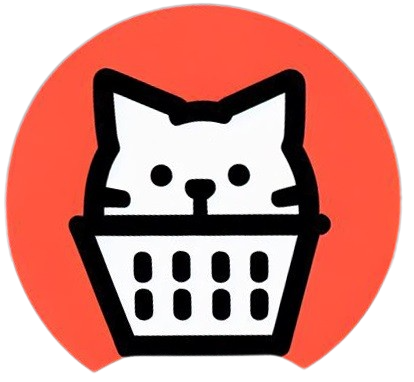

# e-Market
http://e-market.somee.com/

**e-Market** es un proyecto desarrollado en el marco de la materia **Programación 3** de la [Tecnicatura Universitaria en Programación (UTN)](https://www.frgp.utn.edu.ar/carreras/tup_tuss). Desarrollado por Guada Juricich, [Alejandro Morales](https://github.com/AlejandroDanielMorales) y [Alex Welz](https://github.com/alexwelz). El objetivo del proyecto es proporcionar una plataforma web para la gestión y compra de artículos en online.



## Tecnologías Utilizadas

- **Lenguaje**: C# - SQL.
- **Framework**: ASP.NET.
- **Estilos**: Bootstrap.
- **Entorno de Desarrollo**: Visual Studio Community - Azure Data Studio.

  
## ¿Cómo utilizar e-Market?


Para ejecutar este proyecto:

1. Clona el repositorio:
   ```bash
   git clone https://github.com/Gjuricich/e-market.git
   
2. Ejecuta el script de la base.
   
3. Abrí el proyecto en Visual Studio Community.
   
4. Restaura los paquetes NuGet:
   ```bash
   Update-Package -Reinstall
   
5. Ejecuta el proyecto para comenzar.
 
## Licencia 
Code copyright 2023 Guada Juricich - Alejandro Morales - Alex Welz.
